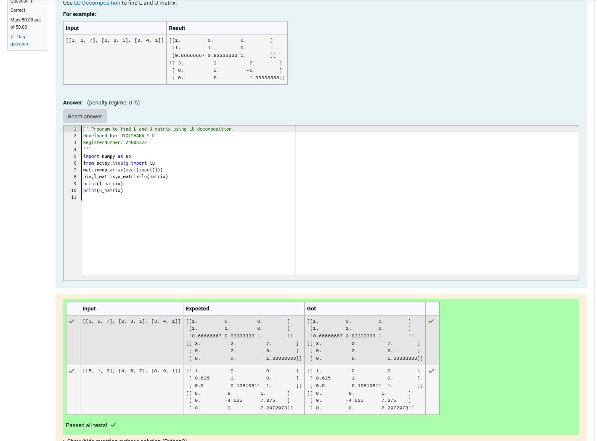
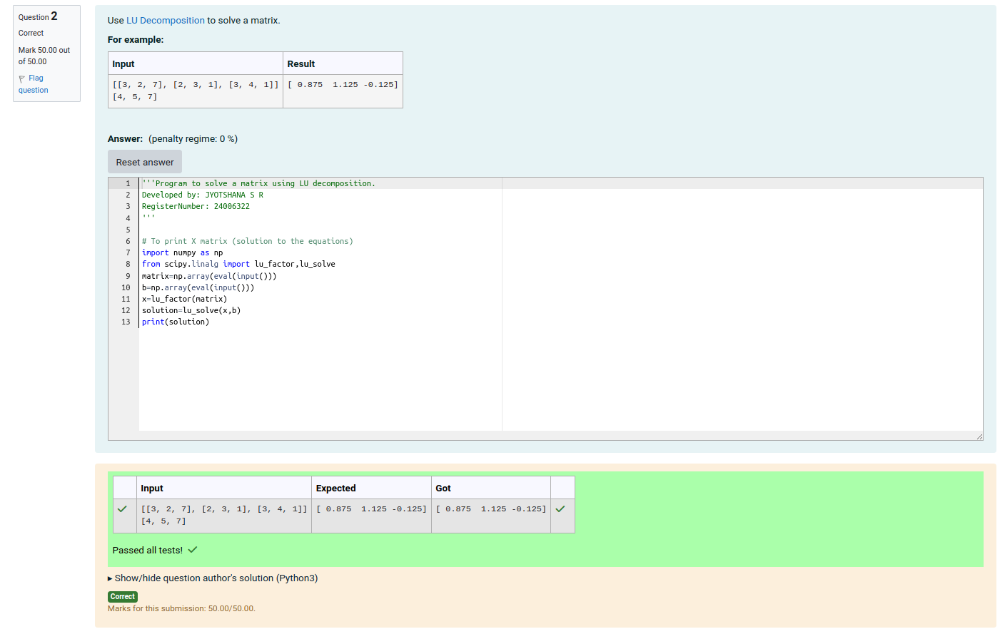

# LU Decomposition 

## AIM:
To write a program to find the LU Decomposition of a matrix.

## Equipments Required:
1. Hardware – PCs
2. Anaconda – Python 3.7 Installation / Moodle-Code Runner

## Algorithm
### L and U matrix
1. Import numpy as np and from scipy.linalg import lu.

2. Prompt the user to enter the matrix and convert it into a NumPy array using matrix=np.array(eval(input())).

3. Call the lu function from scipy.linalg to decompose the matrix into piv, l_matrix, and u_matrix.

4. Print the lower triangular matrix (l_matrix) and the upper triangular matrix (u_matrix).

### LU Decomposition
1. Import numpy as np and from scipy.linalg import lu_factor and lu_solve.

2. Get input for coefficient matrix (A) and constant vector (B).

3. Perform LU decomposition on A using lu_factor.

4. Solve the system using lu_solve with the decomposition result (X) and B.

5. Print the solution.

## Program:
(i) To find the L and U matrix
```
Program to find L and U matrix using LU decomposition.
Developed by: JYOTSHANA S R
RegisterNumber: 24006322


import numpy as np
from scipy.linalg import lu
matrix=np.array(eval(input()))
piv,l_matrix,u_matrix=lu(matrix)
print(l_matrix)
print(u_matrix)

```
(ii) To find the LU Decomposition of a matrix
```
Program to solve a matrix using LU decomposition.
Developed by: JYOTSHANA S R
RegisterNumber: 24006322


# To print X matrix (solution to the equations)
import numpy as np
from scipy.linalg import lu_factor,lu_solve
matrix=np.array(eval(input()))
b=np.array(eval(input()))
x=lu_factor(matrix)
solution=lu_solve(x,b)
print(solution)
```

## Output:
## i). LU MATRIX

## ii). LU DECOMPOSITION



## Result:
Thus the program to find the LU Decomposition of a matrix is written and verified using python programming.

